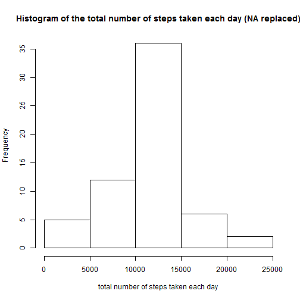

# Reproducible Research: Peer Assessment 1
### Introduction
This assignment will be described in multiple parts. I will write a report that answers the questions detailed below. 
Ultimately, I will complete the entire assignment in a single R markdown document that can be processed by knitr and be transformed into an HTML file.

### Data
This assignment makes use of data from a personal activity monitoring device. 
This device collects data at 5 minute intervals through out the day. 
The data consists of two months of data from an anonymous individual collected during the months of October and November, 2012 and include the number of steps taken in 5 minute intervals each day.

## Loading and preprocessing the data
In this section, I will load and preprocess the data from a CSV file.

### Loading the data

```r
setwd("C:/Users/Ahmad/Documents/R")
df <- read.csv("./RepData_PeerAssessment1/activity/activity.csv")
```

### Preprocessing the data
Date column should be converted to Date data type.

```r
df$date <- as.Date(df$date , format = "%Y-%m-%d")
```
## What is mean total number of steps taken per day?
### creating dataframe with total steps per day

```r
df.day <- aggregate(df$steps, by=list(df$date), sum)
names(df.day)[1] <-"day"
names(df.day)[2] <-"steps"
```

### creating histogram of the total number of steps taken each day

```r
hist(df.day$steps, 
     main = "Histogram of the total number of steps taken each day",
     xlab = "total number of steps taken each day")
```

 


### computing the mean and median of the total number of steps taken per day
Mean of the total number of steps taken per day:

```r
mean(df.day$steps, na.rm = TRUE)
```

```
## [1] 10766
```
Median of the total number of steps taken per day:

```r
median(df.day$steps, na.rm = TRUE)
```

```
## [1] 10765
```


## What is the average daily activity pattern?
The steps below will create a time series plot (i.e. type = "l") of the 5-minute interval (x-axis) and the average number of steps taken, averaged across all days (y-axis):

### creating dataframe with total steps per interval

```r
df.interval <- aggregate(df$steps, by=list(df$interval), sum, na.rm=TRUE, na.action=NULL)
names(df.interval)[1] <-"interval"
names(df.interval)[2] <-"steps"
```
### creating dataframe with mean steps per interval

```r
df.mean.interval <- aggregate(df$steps, by=list(df$interval), mean, na.rm=TRUE, na.action=NULL)
names(df.mean.interval)[1] <-"interval"
names(df.mean.interval)[2] <-"mean.steps"
```

### Creating Time Series plot

```r
plot(df.mean.interval$interval, df.mean.interval$mean.steps, type="n", 
     main="Time Series Plot per 5-minute interval",
     xlab = "5-minute intervals",
     ylab = "Average number of steps taken") 
lines(df.mean.interval$interval, df.mean.interval$mean.steps,type="l") 
```

 

### Maximum number of steps
Which 5-minute interval, on average across all the days in the dataset, contains the maximum number of steps?

```r
df.mean.interval[which.max(df.mean.interval$mean.steps),1]
```

```
## [1] 835
```

The maximum number of steps = 206.1698


## Imputing missing values
### Calculating Total Number of Missing values
Calculate and report the total number of missing values in the dataset (i.e. the total number of rows with NAs):

```r
sum(is.na(df$steps))
```

```
## [1] 2304
```

### Filling in missing values
Devise a strategy for filling in all of the missing values in the dataset.
I will use the mean of the interval as a replacement for missing values. 
The `df.mean.interval` dataframe created above contains mean per interval. 

```r
# merge df and df.mean.interval dataframes
df.missing <- merge(df, df.mean.interval, by = "interval", sort= FALSE)
# sort on date and interval
df.missing <- df.missing[with(df.missing, order(date,interval)), ] 
# replace in steps column NA with value in mean.steps column
df.missing$steps[is.na(df.missing$steps)] <- df.missing$mean.steps[is.na(df.missing$steps)]
# remove the column with the mean since it is no longer needed
df.missing$mean.steps <- NULL 
# round the filled mean steps to get rid of fractions of steps
df.missing$steps <- round(df.missing$steps, digits = 0)
```

### New dataset with missing data filled in
Create a new dataset that is equal to the original dataset but with the missing data filled in.

```r
df.new <- df.missing[, c(2,3,1)]
```

### Histogram of total number of steps
Make a histogram of the total number of steps taken each day and Calculate and report the mean and median total number of steps taken per day. Do these values differ from the estimates from the first part of the assignment? What is the impact of imputing missing data on the estimates of the total daily number of steps?

```r
# create dataframe with total steps per day
df.day.new <- aggregate(df.new$steps, by=list(df.new$date), sum)
names(df.day.new)[1] <-"day"
names(df.day.new)[2] <-"steps"
# create histogram of the total number of steps taken each day
hist(df.day.new$steps, 
     main = "Histogram of the total number of steps taken each day (NA replaced)",
     xlab = "total number of steps taken each day")
```

 

### The mean and median total number of steps taken per day

Mean number of steps per day:

```r
mean(df.day.new$steps, na.rm = TRUE) # na.rm is optional since all NA have been replaced
```

```
## [1] 10766
```
Median number of steps per day:

```r
median(df.day.new$steps, na.rm = TRUE )
```

```
## [1] 10762
```

### Conclusions
* The Mean is equal to the estimates from the first part of the assignment.

* The Median is slightly lower when compared to the first part of the assignment.  

* The histogram shows a similar shape as before with overall higher frequencies due to the NA being replaced in the new histogram.


## Are there differences in activity patterns between weekdays and weekends?

### creating new factor variable
Create a new factor variable in the dataset with two levels - "weekday" and "weekend" indicating whether a given date is a weekday or weekend day.

```r
# create copy of the dataframe
df.new.2 <- df.new
# make sure we use English date names
Sys.setlocale("LC_TIME", "English")
```

```
## [1] "English_United States.1252"
```

```r
# create a factor with the names of the days for all dates
df.new.2$weekdays <- factor(format(df.new.2$date,'%A'))
# show the day levels in the dataframe
levels(df.new.2$weekdays)
```

```
## [1] "Friday"    "Monday"    "Saturday"  "Sunday"    "Thursday"  "Tuesday"  
## [7] "Wednesday"
```

```r
# replace the day levels with two parent levels: weekday and weekend
levels(df.new.2$weekdays) <- list("weekday" = c("Monday", "Tuesday", "Wednesday", "Thursday", "Friday"), "weekend" = c("Saturday", "Sunday"))
# show the parent levels in the dataframe
levels(df.new.2$weekdays)
```

```
## [1] "weekday" "weekend"
```

### creating panel plot
Make a panel plot containing a time series plot (i.e. type = "l") of the 5-minute interval (x-axis) and the average number of steps taken, averaged across all weekday days or weekend days (y-axis):

```r
df.new.2.mean.interval <- aggregate(df.new.2$steps, by=list(df.new.2$weekdays, df.new.2$interval), mean, na.rm=TRUE, na.action=NULL)
names(df.new.2.mean.interval)[1] <-"weekday"
names(df.new.2.mean.interval)[2] <-"interval"
names(df.new.2.mean.interval)[3] <-"mean.steps"

library(lattice) 
xyplot(df.new.2.mean.interval$mean.steps ~ df.new.2.mean.interval$interval | df.new.2.mean.interval$weekday, 
       layout=c(1,2), 
       type="l",
       xlab = "Interval",
       ylab = "Number of steps")
```

 
